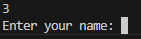

# Module 05 Demonstration Part 2

## Description
Introduction to Unit Testing

## Author

Ivan Estropigan

## Demonstration Topics

- Unit Testing
- Benefits of Unit Testing
- Directory Structure for Source Code and Tests
- Naming Conventions for Tests
- Writing and Running Tests
- Organizing Tests
- Testing Edge Cases
- Testing with Mock Objects
- Testing Exceptions

## What Is Unit Testing?

- Unit testing is a software testing methodology in which individual components or units of a software application are tested in isolation to ensure they are working correctly.

- A unit test focuses on a small part of the code, usually a single function or method and verifies that the code behaves as expected under various input conditions.

- In Python, unit tests can be written using the build-in unittest module or other third-party libraries such as pytest or nose.

- The goal is to create a series of tests that exercise differently aspects of the code and provide confidence in the code's correctness.

## Why Unit Test?

- Here are the main points we will look at:
  - Improved code quality
  - Simplified debugging
  - Better code design
  - Facilitated code refactoring
  - Enhanced collaboration
  - Continuous Integration

- **Improved Code Quality:**
  - By testing each unit of code independently, its possible to identify and fix bugs early in the development process.
  - This can help prevent bugs from propagating through the codebase and reduce the likelihood of introducing new bugs when making changes.

- **Simplified debugging:**
  - When a unit test fails, its easier to pinpoint the source of the problem since the test focuses on a small, isolated piece of code.
  - This can lead to faster debugging and problem resolution.

- **Better Code Design:**
  - Writing unit test encourages developers to create modular, loosely coupled code with well defined interfaces, generally results in a more maintainable and extensible codebase.

- **Facilitated Code Refactoring:**
  - With a comprehensive suite of unit tests, developers can confidently refactor or optimize code without fear of inadvertently breaking existing functionality.
  - If something breaks after we've made changes then the test should show it.

- **Enhanced collaboration:**
  - Unit tests can serve as documentation, clearly demonstrating the intended behavior of the code.
  - This can improve collaboration between team members and reduce misunderstandings or misinterpretations of the code.

- **Continuous Integration:**
  - Unit tests can be easily integrated into Continous Integration(CI) Pipeline, providing rapid feedback on the health of the codebase and ensuring the new changes do not introduce regressions.

## Src And Test Directories

- Organizing code into src(source code) and tests(test code) directories is a common and widely adopted practice in Python programming
  - Especially for larger projects or projects that are intended to be shared, maintained, or collaborated upon by multiple developers.

- Within the src directory is:
  - A __init__.py file (more on this below) as well a python file
  - functions.py containing some pre-coded functions.

- Within the tests directory is:
  - A __ init__.py file (more on this below) as well as a python file
  - test_functions.py containing the starting point of code which will unit test the functions in the src directory.

## __Init__.py

- __init.py files are special files that are used to indicate that the directory they are in should be considered a python package.
  - These files can be empty or can contain python code and are used to perform package initialization.
  - In this course, the files will remain empty.

- By using __init__.py files, you enable the use of absolute import paths within your project
  - This means you can import modules and objects using the full package path, such as from package.module import something

- When the __init__.py file is placed in the root directory of a python project, it signifies that the entire project directory should be treated as a python package.
  - This allows you to organize your code into multiple modules and sub packages within the project

- When placed in the src, tests, or other directories, it treats those directories as python packages and as such these packages can be imported.
  - E.g the src package and its files & functions can be imported into the test_functions.py file.
  - With __init__.py in the tests directory you have the flexibility of including subdirectories in your testing to mirror any subdirectories that may exist in the src directory.

## Unit Testing Basics

- To unit test a function, you need to determine all possible outcomes of the function.
- Open the function.py file and look at the greet_name_age function (docstring not shown):

```cs
def greet_name_age(name: str , age: int) -> str:
    return f"Hello {name}, you are {age} years old!"
```

- What is the outcome of this function?
  - A greeting is returned including a name and age.

## Structure of a test

- In python a unit test typically consists of a test class derived from unittest.TestCase
- Each method within the test class represents a single test case.
- Test case method names should start with test_ to be recognized and executed by the testing framework.

- The unittest module is a built-in python module for writing and running unit tests.
  - It provides a framework for creating test cases, test suites and test runners.
  - It does not require a pip install as it's installed with python 3.
    - A pip install is when we install extra packages/libraries.

## Imports And Filename

- Open the file called test_functions.py:
  - Review the given import statements.
  - import unittest will allow us to leverage the unittest functionality when completing the tests
  - from unittest.mock import patch will allow us to mock i/o behavior in the tests. More on this later..
  - Import the function to the unit test file:

```cs
from src. functions import greet_name_age
```

- **Note**: The filename for the test file is important.
  - The test `discovery` process that willl take place later will look for files that have a test_prefix in the file name.
  - The filename should start with the test_prefix followed by the name of the code file being tested.
  - E.G test_functions.py

## Test Class

- All test must be included in a test class
  - We haven't covered classes yet.
  - Think of them like blueprints for Things/Concepts/Objects
    - What are some data points that we would use to represent a person? a student?

- The classes created will have built within it some predefined unit test functionality that we will use.
- The class we are creating will inherit this functionality.
  - There appears to be a lot of similarities between students and persons..

- More on classes in the next module, for now define the class, and all tests cases will be within the class block:

```cs
class TestFunctions(unittest.TestCase):
```

- Class name: TestFunction - Uses TitleCase as a naming convention.
  - Also begins with the Test followed by the code module being tested within this test class (Functions)

- :Ends with a colon which signifies a block. (like if, loops, functions...)

- All tests will be written in this block (indented)

## First Test

- Define the test method header as follows:

```cs
def test_greet_name_with_all_parameters(self):
```

- self: Self refers to an instance of TestCase. Anytime we want to use the inherited TestCase functionality, we will refer to that functionality through self.

- Write test methods within the test class, using the three A's of unit testing:
  - Arrange
  - Act
  - Assert

```cs
# Arrange
[Define my variables]

#Act
[Run the code you're testing]

#Assert
[Compare expected output with output from the act phase]
```

- Set up (Arrange): Provide values for each of the two function parameters:

```cs
# Arrange
name = "Joe"
age = 25
expected = "Hello Joi, you are 25 years old!"

Note: Spelled joe incorrectly to show failed test.
```

## Running Tests

- To Run unit test there are couple of methods lets cover command line first
- To run the current test we can use the following command:
  - To use this command when working on a specific test
  - If the python terminal is not open in vs code, select terminal/New Terminal from the menu

```cs
python -m unittest -k test_greet_name_with_all_parameters
```

- In the above:
  - -m option: Indicates you are executing a module - in this case the unittest module
  - -k option: Is used to specify a pattern to match the test method names

## Review Test Results

```cs
- Hello Joi, you are 25 years old! != "Hello Joe, you are 25 years old!"

- Hello Joi, you are 25 years old!
?         ^
+ Hello Joe, you are 25 years old!
?         ^
```

- The results show that the expected does not match the actual result.
- Two possible reasons:
  - The source code has an error that has been identified by the test
  - The test contained an error (in this case the test had misspelled "Joe")

- Correct the error and re-run the test:

```cs
expected = "Hello Joe, you are 25 years old!
```

- In the terminal re-run the test  (use the up arrow to recall the last command):

```cs
python -m unittest -k test_greet_name_with_all_parameters

Ran 1 test in 0.000s

OK
```

## Review Values

- Functions can return a value using the return keyword, followed by the value to be returned.
- When a return statement is executed, the function exits, and the returned value is passed back to the caller.
- Code the following function

- Test the function:

```cs
result = math_operation(1,3, "+")
print(result)

print(math_operation(6,10, "-"))
```

- What happens if an operator other than + or - is provided to the function?
- Try calling the math_operation function with "*" operation

```cs
print(math_operation(5, 5, "*"))
# expected 25, actual 0
```

it is defaulted to subtract due because of else

## Functions.Py

- Return to functions.py 
- Review the grade_outcome function.
- What are the possible outcomes?

- Outcomes:
  1. A grade greater than 90 "A" + is returned
  2. A grade between 50 and 90 inclusive, a grade of "Pass" is returned
  3. Otherwise, a grade a "Fail" is returned

```cs
def grade_outcome(grade: int) -> str:
    """
    Description:
        Provides a string outcome based on a grade argument.

    Args:
        grade (int): The earned grade.
    
    Returns:
        str: The string equivalent to the grade.
    """
    if grade > 90:
        output = "A+"

    elif grade >= 50:
        output = "Pass"

    else:
        output = "Fail"
```

## Second Set Of Tests

1. A grade greater than 90, "A+' is returned
  - Import the grade_outcome function into test_function.py

```cs
from src. functions import greet_name_age, grade_outcome
```

- Write the first test:

```cs
def test_grade_outcome_a_plus(self):
    # Arrange
    grade = 91
    expected = "A+"
 
    # Act
    actual = grade_outcome(grade)
 
    # Assert
    self.assertEqual(expected, actual)
```

- Run the test:

```cs
python -m unittest -k test_grade_outcome_a_plus

```

- Or To Run All Test in a file you can use the following command:

## Next Test

- Define a test fora second outcome:

- A grade between 50 and 90 inclusive, a grade of 'Pass' is returned

```cs
def test_grade_outcome_pass(self):
  # Arrange 
  grade = 76 
  expected = "Pass"

  # Act
  actual = grade_outcome(grade)

  # Assert 
  self.assertEqual(expected, actual)
```

- Run the test:

```cs
python -m unittest tests/test_functions.py

Ran 3 tests in 0.000s

OK
```

## Edge Cases

- We want to make sure that the edge cases for a grade between 50 and 90 inclusive are also handled so that an invalid grade is not assigned incorrectly when on the cusp of a grade change.

- Modify the previous test as follows:

```cs
def test_grade_outcome_pass(self):
    # Arrange
    grade = 76
    low_edge = 50
    high_edge = 90
    expected = "Pass"
  
    # Act
    # COMMENT OUT actual = grade_outcome(grade)
 
    # Act and Assert, including edge cases
    self.assertEqual(expected, grade_outcome(grade))
    self.assertEqual(expected, grade_outcome(low_edge))
    self.assertEqual(expected, grade_outcome(high_edge))
```

- Run the tests and ensure it passes

## Next Test

- Define a test for the third outcome:
- Otherwise a grade of 'Fail' is returned

```cs
def test_grade_outcome_fail(self):
    # Arrange
    grade = 40
    high_edge = 49
    negative = -1
    expected = "Fail"

    # Act and Assert, including edge cases
    self.assertEqual(expected, grade_outcome(grade))
    self.assertEqual(expected, grade_outcome(high_edge))
    self.assertEqual(expected, grade_outcome(negative))
```

- Run the test and ensure it passes

## Functions.Py

- Return to functions.py
- Review the prompt_name_greting function.
- What are the possible outcomes?

```cs
def prompt_name_greeting (grade: int) -> str:
    name = input("Enter your name: ")
    city = input("Enter your current city: ")

    return f"Your name is {name} and your current city is {city}."
```

- Outcomes:
Your name is {name} and your current city is {city}.

## Third Set Of Tests

- Your name is {name} and your current city is {city}
  - Update the import Statement:

```cs
from src.functions import greet_name_age, grade_outcome, prompt_name_greeting
```

- The prompt_name_greeting function involves user interaction - the input function is used to prompt the user for a name and a city.
- Unit tests should run without the need to pause for user input.
- The user input can be 'mocked' within unit tests

## Mocking In Tests

- Mock objects are used in unit testing to simulate the behavior of real objects or dependencies that are not part of the unit being tested.

- Using mocks can help isolate the unit being tested and ensure that the test only focuses on the behavior of the unit itself.

- Python's built-in unittest.mock module provides a powerful framework for creating using mock objects.

- Note the given import statement:

```cs
from unittest.mock import patch
```

- When testing a function that uses the input function, you might want to simulate user input without acutally requiring user interaction

- By 'patching' the input function you can control what values are returned by input during the test, allowing you to test different scenarios and edge cases.
  - Aka: WE make our own input() function that will automatically return what we want it to

## Slide 38 Functions.Py

- Return to functions.py
- Review the math_operations function
- What are the possible outcomes?

```cs
def math_operation(grade: int) -> str:
    if operation == "+":
        result = operand1 + operand2
    elif operation == "-":
        result = operand1 - operand2
    else:
        raise ValueError("Invalid operation.")   
    
    return result
```

- Outcomes:
  - Successful Addition
  - Successful Subtraction
  - Successful An invalid operation
  - Successful non-numeric operand

## Fourth Set Of Tests

- Update the import statment and create the first 2 tests:

```cs
def test_math_operations_successful_add(self):
    # Arrange
    op1 = 10
    op2 = 20
    opt = "+"
    expected = 30

    # Act
    actual = math_operation(op1, op2, opt)

    # Assert
    self.assertEqual(expected, actual)


```

```cs
def test_math_operations_successful_sub(self):
    # Arrange
    op1 = 30
    op2 = 20
    opt = "-"
    expected = 10

    # Act
    actual = math_operation(op1, op2, opt)

    # Assert
    self.assertEqual(expected, actual)

```

- Run the tests:

```cs
Ran 6 tests in 0.000s
OK
```

## Testing Exceptions

- Outcome to test:
  - An exception when an invalid operation is provided.

- The unittest.testcase class has built in functionality to confirm that under certain conditions an exception is raised.

- The `assertRaises' context manager (with clause) encloses the code that should raise the exception
  - (e.g a call to a function with invalid parameters).

- The assertRaises will confirm that an exception has been raised.

- Additionally when an exception is raised within the assertRaises context manager (with the handle `context' below): the context object can be queried for the actual exception message.

- A second assert can be used to verify the correct error message:

```cs
def test_math_operation_bad_operator_raises_exception(self):
    # Arrange
    operand1 = 30
    operand2 = 20
    operator = "*"
    expected = "Invalid operation."

    # Act and Assert
    # assertRaises(ValueError) <-- because function raises 
    # ValueError when an invalid operator is provided
    with self.assertRaises(ValueError) as context:
        math_operation(operand1, operand2, operator)
            
    self.assertEqual(expected, str(context.exception))
```

- Run the tests:

```cs
Ran 7 tests in 0.000s
OK
```

## Final Test

- Outcome to test:
  - An exception when an operand has the wrong data type.

```cs
def test_math_operation_non_numeric_operand_raises_exception(self):
    # Arrange
    operand1 = "30"  # <- non-numeric
    operand2 = 20
    operator = "-"

    # Act and Assert
    # assertRaises(ValueError) <-- because function raises 
    # ValueError when an invalid operator is provided
    with self.assertRaises(TypeError) as context:
        math_operation(operand1, operand2, operator)
            
   # In this case, we don't control the exception message
   # because it is not raised explicitly by the programmer
   # Therefore, no assert for the error message.
```

## Integration Test

- Each of the functions in function.py have been individually tested(unit tested)

- A final test may involve integrating each of the functions into a single block of code to ensure they work fine together.

- Return to functions.py

- Code the following at the bottom of the editor:

```cs
print( math_operation(1, 2, "+") )
print( prompt_name_greeting() )
```

- Run the python application (functions.py, not the test):

```cs
3
Enter your name: {your name}
Enter your current city: {your city}
Your name is {name} and your current city is {city}.
```

- Now run the Unit Test:

```cs
python -m unittest tests/test_functions.py
```

- Note  the unit test operation is being interrupted by the prompts for name and city

```cs

```

## Main Guard

- A main guard can be added to the source code to run the individual tests in an integrated way, but will not execute when the unit tests are run.

- A main guard, checks the context from which the code is being called.

- If the function.py file is being directly executed, then the code in the main guard will execute.

- If the code in functions.py is being indirectly executed (e.g by way of unit tests) then the code in the main guard will not execute.

## Additional Function and Unit Test Content

- The course notes provide additional content on the subjects of Functions and Unit Testing.
- This lecture focused on the techniques needed to complete Assignment 5.

## Defining Functions

A Function is a small, reusable pieces of code that performs a specific task. In Python you, create a function using the def keyword, followed by a unique identifier, parentheses, parameters and a colon. The indented lines following the colon make up the function body.

Here's a simple function example with comments to explain the code:

```python
def greet() -> None:
  """
  Description:
    Prints a greeting message to the console.

  When this function is called, print the message "Hello World" to the console.
  """

  print("Hello World")
  
  # Invoke the function by its name.

greet()
```

## Benefits Of Using Functions

Functions provide several benefits making your code more efficient, organized and easier to maintain:

- **Modularity**: Functions break complex tasks into smaller, manageable pieces, simplifying your program's structure.

- **Reusability**: Functions can be called multiple times from different parts of your code, preventing repetitive code and saving time.

- **Maintainability**: Functions improve code maintainability by making it more organized and readable. If you need to make changes, you can update the function instead of editing multiple instances of the same code.

- **Debugging**: Functions make it easier to identify and resolve bugs by dividing code into smaller units. You can test each function seperately to ensure they work correctly before integrating them.

- **Abstraction**: Functions hide the complexity of specific tasks, simplifying code comprehension. You can execute a task by calling a function without knowing its inner workings.

Understanding and effectively using functions are crucial for creating clean, efficient and maintainable python programs. Throughout the course, you'll encounter more examples and use cases for functions in python.

## Function Definition And Syntax

The syntax of a function is:

```py
def method_identifier(parameter_list, ...):
    # Implementation
```

In Python, functions are defined using the def keyword, followed by a unique function identifier, paraentheses containing parameters (optional), and a colon(:)
